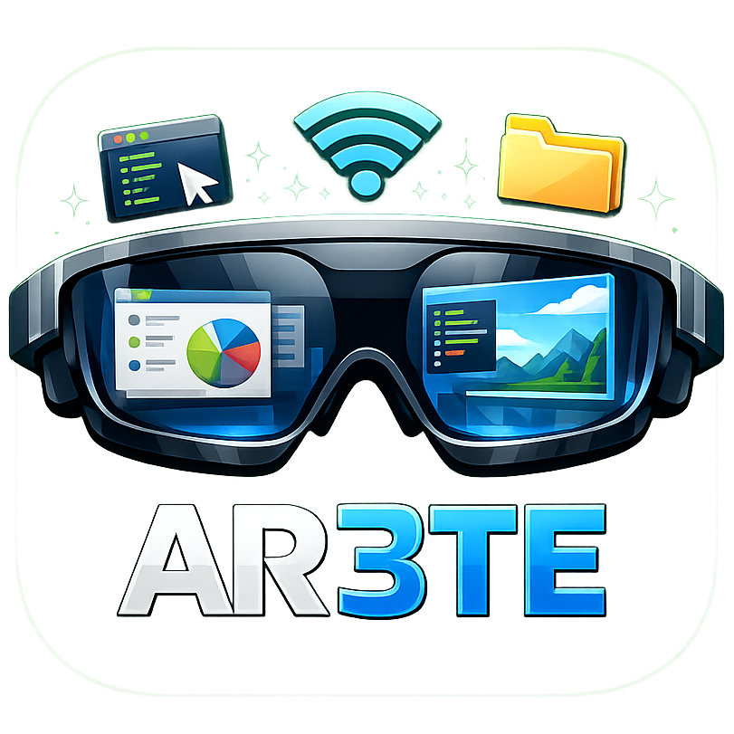

# AR3TE



AR3TE is an Android remote display client for AR glasses and mobile devices. It discovers a Windows host on the local network, streams the PC display over WebSocket, and provides phone-based input controls for remote interaction.

## Overview

AR3TE pairs an Android client with a Windows host server:

- Android app: discovers AR3TE hosts on the LAN, displays the live remote screen, and provides virtual trackpad, keyboard, monitor switching, and RayNeo 3DOF controls.
- Host server (`server/`): handles UDP discovery, screen capture, cursor/control messages, and WebSocket video streaming.

## Requirements

### Android client

- Android Studio
- Android device or emulator running API 24+
- Optional RayNeo Air 3S Pro glasses for 3DOF view controls

### Windows host

- Windows 10/11
- Node.js 18+
- .NET SDK to build `Capture.exe` from `server/Capture.cs`
- FFmpeg available on `PATH` or through `FFMPEG_PATH`

## Getting Started

### 1. Run the host server

```bash
cd server
npm install
npm run dev
```

The server listens on:

| Service | Port |
| --- | --- |
| UDP discovery | 45678 |
| WebSocket stream | 45679 |

On first run, build the capture helper if needed:

```bash
dotnet build Capture.csproj -c Release
```

### 2. Run the Android app

1. Open the project in Android Studio.
2. Build and run AR3TE on a device connected to the same local network as the PC.
3. Grant notification permission when prompted.
4. Select a discovered machine to view its screen.

## Project Structure

```text
app/      Android client (Kotlin, Jetpack Compose)
server/   Windows host
  server.js      Discovery and WebSocket relay
  Capture.cs     DXGI screen capture helper
  package.json   Host server scripts and dependencies
```

## How It Works

1. The Android app broadcasts `AR3TE_DISCOVER` over UDP.
2. The host server responds with machine name, IP address, and stream ports.
3. The app connects via WebSocket and receives video frames from the host capture pipeline.
4. Monitor selection, cursor movement, keyboard input, and debug controls are sent back to the host as JSON control messages.

## License

Private project.
